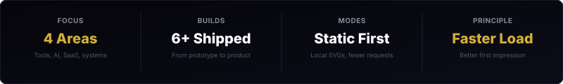

  

  

  I build developer tools, SaaS systems, and AI workflows with a bias toward reliability, maintainability, and fast-loading interfaces.

---

### Current Focus

- Scaling MockPilot as a practical mock API and infrastructure layer for product teams.
- Shipping cleaner backend workflows for agentic automation and internal developer tools.
- Designing systems that keep working when third-party services fail.

### High-Signal Work

- MockPilot: AI-powered mock API generation for schema-driven endpoints. Stack: Next.js, Node.js, Express, PostgreSQL, Docker.
- CropCast: Agricultural intelligence and forecasting with machine learning. Stack: React, Flask, Python, Scikit-Learn, MongoDB.
- Memex: A second-brain workspace built around linked notes and graph navigation. Stack: React, Node.js, MongoDB, D3.js.
- Cypher Resume Analyzer: Resume screening and role matching with NLP-assisted scoring. Stack: JavaScript, Node.js, Express, Gemini API, CSS.

### Operating Principles

- Build products, not demos.
- Solve high-friction problems first.
- Automate anything repeated.
- Prefer static assets and build-time generation over live widgets.

### Stack Snapshot

- Frontend: React, Next.js, HTML, CSS.
- Backend: Node.js, Express, Flask.
- Data: PostgreSQL, MongoDB, Supabase.
- Systems: Docker, Git, REST APIs, LLM integrations.

### Roadmap

- Q3 2023: Android certification and mobile lifecycle patterns.
- Q4 2023: MongoDB certification and document-model optimization.
- Q1 2024: Hackathon work across Tensor Hackathon and Smart India Hackathon.
- Q3 2024: MockPilot v1.0 shipped.
- Q1 2025: CropCast and Memex expanded into active product work.
- Now: Refining developer tooling, SaaS architecture, and AI-assisted workflows.

### Collaboration

I am most useful on developer tools, internal platforms, AI workflow systems, and performance-minded product engineering. If a project needs cleaner architecture, faster iteration loops, or less dependency on external runtime services, that is the right conversation.

### GitHub Activity

  

  

  <a href="https://github.com/TheCreativeCodeFlow"><strong>GitHub</strong></a> &bull;
  <a href="https://www.linkedin.com/in/rahul-seervi-thecreativecodeflow/"><strong>LinkedIn</strong></a> &bull;
  <a href="https://rahulseervi.vercel.app/"><strong>Portfolio</strong></a> &bull;
  <a href="mailto:thecreativecodeflow@gmail.com"><strong>Email</strong></a>

