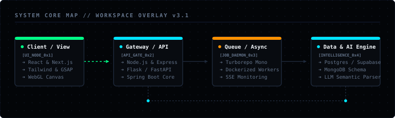
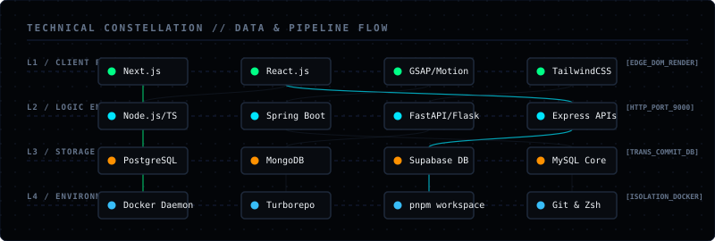
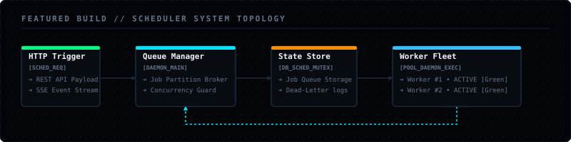
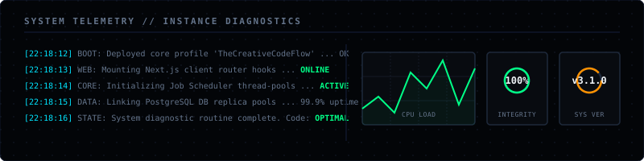

# SYSTEM // ENGINEERING PROFILE

<p align="center">
  
</p>

<p align="center">
  
  &nbsp;&nbsp;
  
  &nbsp;&nbsp;
  
</p>

## RAHUL SEERVI
**`FULL-STACK ENGINEERING • DISTRIBUTED SYSTEMS • PLATFORMS • AI INTEGRATION`**

> Full-stack software engineer specialized in designing resilient background systems, API infrastructures, and predictive engines. Focused on building clean system architectures, developer tools, and high-performance user interfaces.

`BUILDING ➔ LEARNING ➔ SHIPPING ➔ REPEATING`

<p align="center">
  
</p>

---

<p align="center">
  <code><a href="#-core-engineering-pillars">SYSTEM CAPABILITIES</a></code> &nbsp;▪&nbsp;
  <code><a href="#-technical-constellation">CONSTELLATION</a></code> &nbsp;▪&nbsp;
  <code><a href="#-featured-build-distributed-job-scheduler">FEATURED BUILD</a></code> &nbsp;▪&nbsp;
  <code><a href="#-project-ledger">PROJECT LEDGER</a></code> &nbsp;▪&nbsp;
  <code><a href="#-kernel-specifications--system-logs">KERNEL SPECS</a></code> &nbsp;▪&nbsp;
  <code><a href="#-telemetry--system-diagnostics">TELEMETRY</a></code> &nbsp;▪&nbsp;
  <code><a href="#-external-system-connection">CONNECT</a></code>
</p>

---

### ⚡ Core Engineering Pillars

#### 1. Predictable Architecture
*Fail gracefully, recover predictably, scale horizontally.*  
Building robust systems involves structuring decoupled microservices, handling high-throughput queues, and ensuring transactional consistency across distributed boundary runtimes.

#### 2. Ecosystem Thinking
*Integrate UI logic, backend APIs, data pipelines, and intelligent models seamlessly.*  
Software is more than code—it is an ecosystem. Designing clean interfaces (React, Next.js) that coordinate with high-performance APIs (Node.js, Flask) and optimized database engines (PostgreSQL, Supabase) is critical.

#### 3. High-Velocity Developer Experience (DX)
*Automate the mundane, focus on the architecture.*  
Leveraging monorepos (Turborepo), clean workspace package managers (pnpm), automated build pipelines, and strict type boundaries to keep shipping friction at absolute zero.

---

### 🌌 Technical Constellation

<p align="center">
  
</p>

---

### 🚀 Featured Build: Distributed Job Scheduler

> **Architecture Type**: Microservices Monorepo  |  **Focus**: Queue &amp; Worker Systems  |  **Status**: Active Development

#### The Problem
Enqueuing, scheduling, partitioning, and auditing asynchronous tasks predictably without causing thread starvation, race conditions, or worker bottlenecks.

#### System Architecture
<p align="center">
  
</p>

#### The Implementation
*   **Monorepo Structure**: Engineered with `pnpm` workspaces and `Turborepo` to ensure shared configurations, isolated dependencies, and blazing-fast local caching loops.
*   **Docker Containerization**: Containers spin up dynamically to allocate and execute tasks, preventing single-worker overload.
*   **Real-time Event Stream**: Uses Server-Sent Events (SSE) to push job lifecycle state transitions (Enqueued ➔ Running ➔ Completed ➔ Failed) directly to a centralized monitoring terminal dashboard.

#### Key Repositories
*   [`Distributed-job-Scheduler`](https://github.com/TheCreativeCodeFlow/Distributed-job-Scheduler) — Core scheduling engine, queue scheduler, and telemetry server.

---

### 📁 Project Ledger

An indexed registry of engineering projects built with specific architectural constraints.

| Project | Primary Focus | Tech Stack | Status |
| :--- | :--- | :--- | :--- |
| **[CodeZilaa](https://github.com/TheCreativeCodeFlow/CodeZilaa)** | Line-by-line program execution visualizer and practice sandbox | Next.js, React, TypeScript, TailwindCSS, Framer Motion | `Active Development` |
| **[MockPilot](https://github.com/TheCreativeCodeFlow/MockPilot)** | Schema-driven mock API generation for automated testing infrastructure | Next.js, Node.js, Express, PostgreSQL, Docker | `Production / SaaS` |
| **[CropCast](https://github.com/TheCreativeCodeFlow/CropCast)** | Predictive harvest forecasting utilizing microclimate ML models | React, Flask, Python, Scikit-Learn, MongoDB | `Active Development` |
| **[Memex](https://github.com/TheCreativeCodeFlow/Memex)** | Linked markdown knowledge visualizer using force-directed graph models | React, Node.js, MongoDB, D3.js | `Completed / Archival` |
| **[Cypher Resume Analyzer](https://github.com/TheCreativeCodeFlow/Cypher-Resume-Analyzer)** | NLP semantic mapping pipelines matching profiles to scorecards | JavaScript, Node.js, Express, Gemini API | `Stable Release` |
| **[PharmaCare](https://github.com/TheCreativeCodeFlow/Pharmacy-Inventory-Management-System)** | Stock optimization dashboard with low-inventory warnings | React, Express, Supabase, CSS | `Stable Release` |
| **[WebGL Portfolio](https://github.com/TheCreativeCodeFlow/About-ME)** | Canvas interactive particles using custom rigged webgl shaders | React, GSAP, Three.js, Lenis | `Stable Release` |
| **[University Portal](https://github.com/TheCreativeCodeFlow/University-Management-System)** | Student portal featuring transactional course enrollment queues | Java, Spring Boot, MySQL, Thymeleaf | `Archived` |

---

### ⚙️ Kernel Specifications &amp; System Logs

#### Environmental Configuration
```text
WORKSPACE_ENV ➔
├── SHELL         ➔ /bin/zsh
├── EDITOR        ➔ nvim (Neovim)
├── RUNTIMES      ➔ Node.js v20 / Python 3.11 / Java 17
├── MODULE_PACKS  ➔ pnpm workspace / Turborepo monorepo
├── LOCAL_HOST    ➔ Decoupled offline mock runtimes
└── TYPE_SECURITY ➔ TypeScript strict boundary schemas
```

#### System Event Logs (Achievements)
```text
SYS_EVENTS ➔
├── [Q1 2026] ➔ Deployed CodeZilaa & Distributed Job Scheduler workspaces
├── [Q1 2024] ➔ Smart India & Tensor Hackathons — Compiled predictive models
├── [Q4 2023] ➔ MongoDB Developer Certification — Checked document-model metrics
└── [Q3 2023] ➔ Android Developer Certification — Checked mobile lifecycles
```

---

### 📊 Telemetry &amp; System Diagnostics

<p align="center">
  
</p>

<h4 align="center">ACTIVE CONTRIBUTION GRID</h4>
<p align="center">
  
</p>

<p align="center">
  <a href="https://github.com/TheCreativeCodeFlow">
    
  </a>
  <a href="https://github.com/TheCreativeCodeFlow">
    
  </a>
</p>

---

### 🧭 Current Workspaces &amp; Exploration

```text
NOW ➔
├── 🛠️ Building: Enterprise SaaS mock infrastructures & system state monitors
├── 🧠 Exploring: Multi-worker partition logic & stream synchronizations (SSE)
├── 📖 Learning: Advanced Android lifecycle internals & transactional database configurations
└── 🚀 Tuning: Performance load factors of deep client canvas rendering systems
```

---

### 🔌 External System Connection

Establish a direct socket connection via the parameters below:

```text
SSH Endpoint: ssh://TheCreativeCodeFlow@github
Optimal Input: Systems design, background workers, interactive engines, product loops.
Target Port:  contact.sys
```

<p align="center">
  <code><a href="https://github.com/TheCreativeCodeFlow">GITHUB.SYS</a></code> &nbsp;▪&nbsp;
  <code><a href="https://www.linkedin.com/in/rahul-seervi-thecreativecodeflow/">LINKEDIN.SYS</a></code> &nbsp;▪&nbsp;
  <code><a href="https://rahulseervi.vercel.app/">PORTFOLIO.SYS</a></code> &nbsp;▪&nbsp;
  <code><a href="mailto:thecreativecodeflow@gmail.com">EMAIL.SYS</a></code>
</p>

---

<p align="center">
  <font size="2" color="#00FF87">ENGINEERED WITH CURIOSITY // BUILT WITH PURPOSE // SHIPPED WITH DISCIPLINE</font>
  <br />
  <strong>Rahul Seervi</strong>
</p>
